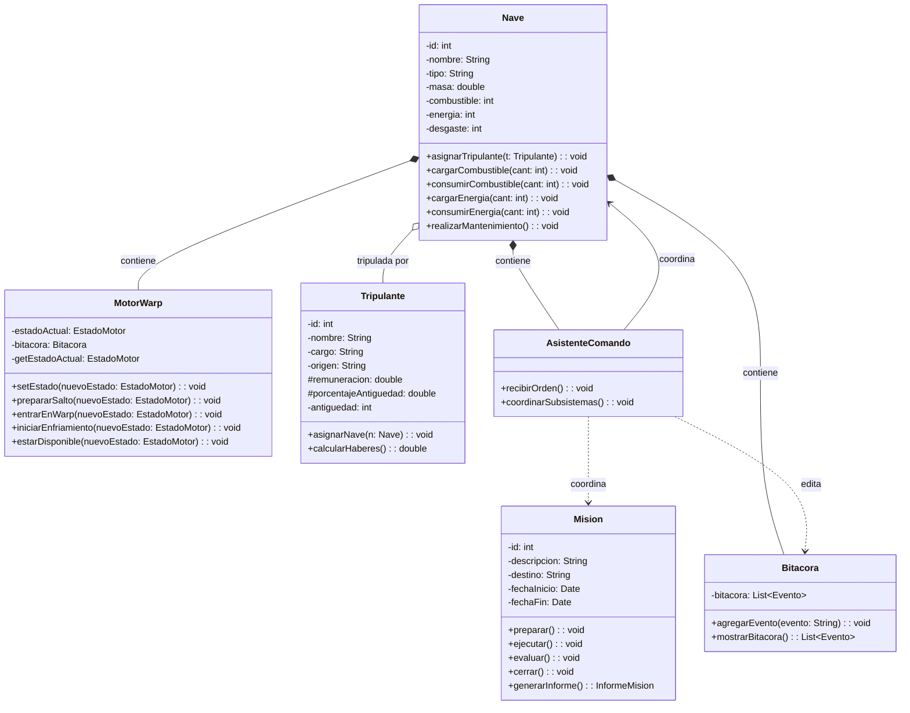

# Diagrama de clases UML:

```mermaid
classDiagram
    class Nave {
        -id: int
        -nombre: String
        -tipo: String
        -masa: double
        -combustible: int
        -energia: int
        -desgaste: int
        +asignarTripulante(t: Tripulante): void
        +cargarCombustible(cant: int): void
        +consumirCombustible(cant: int): void
        +cargarEnergia(cant: int): void
        +consumirEnergia(cant: int): void
        +realizarMantenimiento(): void
    }

    class MotorWarp {
        -estadoActual: EstadoMotor
        -bitacora: Bitacora
        -getEstadoActual: EstadoMotor
        +setEstado(nuevoEstado: EstadoMotor): void
        +prepararSalto(nuevoEstado: EstadoMotor): void
        +entrarEnWarp(nuevoEstado: EstadoMotor): void
        +iniciarEnfriamiento(nuevoEstado: EstadoMotor): void
        +estarDisponible(nuevoEstado: EstadoMotor): void
    }

    class Tripulante {
        -id: int
        -nombre: String
        -cargo: String
        -origen: String
        #remuneracion: double
        #porcentajeAntiguedad: double
        -antiguedad: int
        +asignarNave(n: Nave): void
        +calcularHaberes(): double
    }

    class AsistenteComando {
        +recibirOrden(): void
        +coordinarSubsistemas(): void
    }

    class Bitacora {
        -bitacora: List~Evento~
        +agregarEvento(evento: String): void
        +mostrarBitacora(): List~Evento~
    }

    class Mision {
        -id: int
        -descripcion: String
        -destino: String
        -fechaInicio: Date
        -fechaFin: Date
        +preparar(): void
        +ejecutar(): void
        +evaluar(): void
        +cerrar(): void
        +generarInforme(): InformeMision
    }

    Nave *-- MotorWarp : contiene
    Nave *-- AsistenteComando : contiene
    Nave *-- Bitacora : contiene
    Nave o-- Tripulante : tripulada por
    AsistenteComando ..> Mision : coordina
    AsistenteComando ..> Bitacora : edita
    AsistenteComando --> Nave : coordina
```
