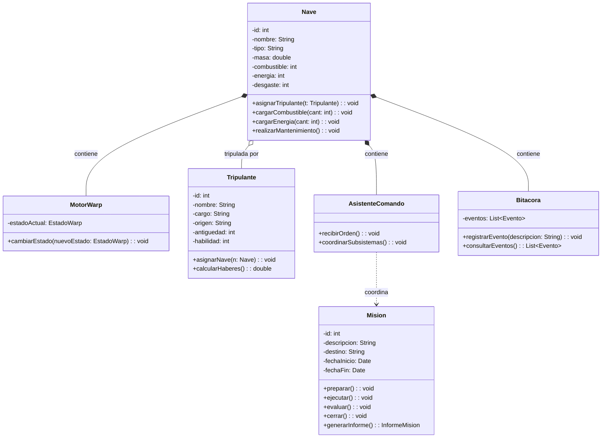

# Diagrama de clases UML:

```mermaid
classDiagram
    class Nave {
        -id: int
        -nombre: String
        -tipo: String
        -masa: double
        -combustible: int
        -energia: int
        -desgaste: int
        +asignarTripulante(t: Tripulante): void
        +cargarCombustible(cant: int): void
        +cargarEnergia(cant: int): void
        +realizarMantenimiento(): void
    }

    class MotorWarp {
        -estadoActual: EstadoWarp
        +cambiarEstado(nuevoEstado: EstadoWarp): void
    }

    class Tripulante {
        -id: int
        -nombre: String
        -cargo: String
        -origen: String
        -antiguedad: int
        -habilidad: int
        +asignarNave(n: Nave): void
        +calcularHaberes(): double
    }

    class AsistenteComando {
        +recibirOrden(): void
        +coordinarSubsistemas(): void
    }

    class Bitacora {
        -eventos: List~Evento~
        +registrarEvento(descripcion: String): void
        +consultarEventos(): List~Evento~
    }

    class Mision {
        -id: int
        -descripcion: String
        -destino: String
        -fechaInicio: Date
        -fechaFin: Date
        +preparar(): void
        +ejecutar(): void
        +evaluar(): void
        +cerrar(): void
        +generarInforme(): InformeMision
    }

    Nave *-- MotorWarp : contiene
    Nave *-- AsistenteComando : contiene
    Nave *-- Bitacora : contiene
    Nave o-- Tripulante : tripulada por
    AsistenteComando ..> Mision : coordina
```
