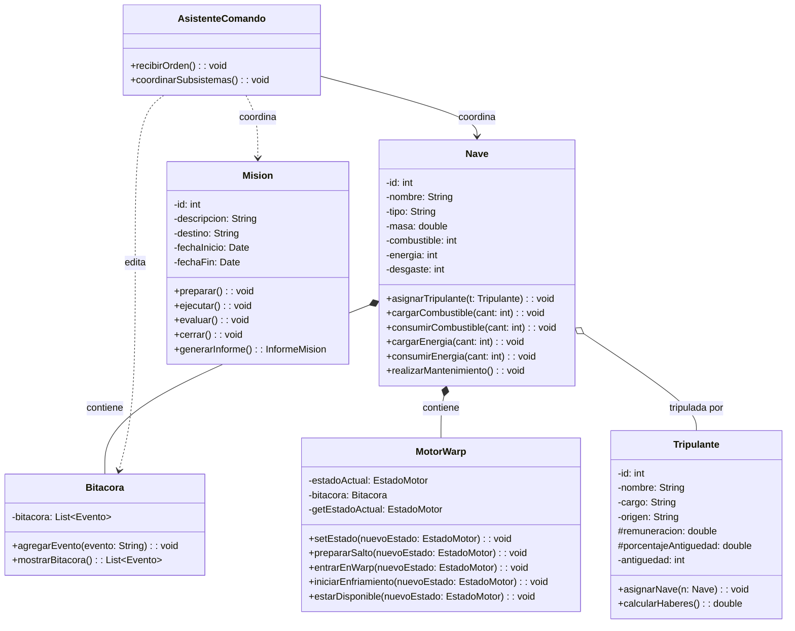

# TP Grupal Programación C2026

Simulador de una nave estelar en Java 8. **La documentación completa está en la
[wiki del proyecto](https://github.com/CamilaSanchezB/TPGrupalProgramacionC2026/wiki/Home)**: arquitectura, contratos (PRE/POST/INV),
diagramas UML especializados de los patrones State, Template Method, Decorator y
Factory, escenarios de prueba e instrucciones de compilación.

| | |
|---|---|
| [Arquitectura](https://github.com/CamilaSanchezB/TPGrupalProgramacionC2026/wiki/Arquitectura) | Capas, paquetes y dependencias |
| [Modelo de dominio](https://github.com/CamilaSanchezB/TPGrupalProgramacionC2026/wiki/Modelo-de-Dominio) | Diagrama de clases completo |
| [Contratos](https://github.com/CamilaSanchezB/TPGrupalProgramacionC2026/wiki/Contratos) | PRE / POST / INV por clase |
| [State](https://github.com/CamilaSanchezB/TPGrupalProgramacionC2026/wiki/Patron-State-MotorWarp) | Motor Warp |
| [Template Method](https://github.com/CamilaSanchezB/TPGrupalProgramacionC2026/wiki/Patron-Template-Method-Mision) | Misiones |
| [Decorator](https://github.com/CamilaSanchezB/TPGrupalProgramacionC2026/wiki/Patron-Decorator-Tripulantes) | Origen del tripulante |
| [Factory](https://github.com/CamilaSanchezB/TPGrupalProgramacionC2026/wiki/Patron-Factory-Naves) | Creación de naves |
| [Compilar y ejecutar](https://github.com/CamilaSanchezB/TPGrupalProgramacionC2026/wiki/Compilar-y-Ejecutar) | Build y opción `-ea` |

---

# Diagrama de clases UML:

