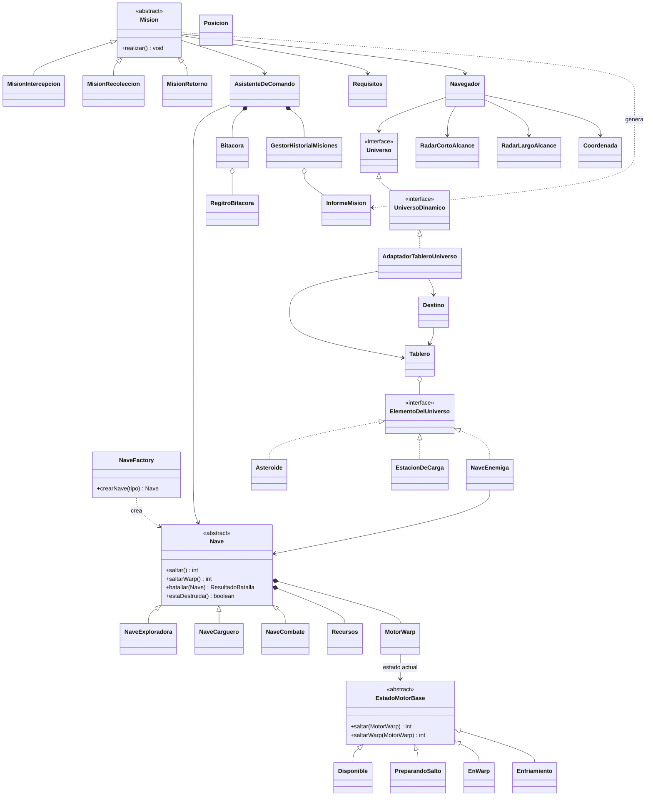

```mermaid
classDiagram
    direction TB

    class Nave {
        <<abstract>>
        +saltar() int
        +saltarWarp() int
        +batallar(Nave) ResultadoBatalla
        +estaDestruida() boolean
    }
    class NaveExploradora
    class NaveCarguero
    class NaveCombate
    class NaveFactory {
        +crearNave(tipo) Nave
    }
    class Recursos
    class MotorWarp
    class EstadoMotorBase {
        <<abstract>>
        +saltar(MotorWarp) int
        +saltarWarp(MotorWarp) int
    }
    class Disponible
    class PreparandoSalto
    class EnWarp
    class Enfriamiento
    class AsistenteDeComando
    class Bitacora
    class RegitroBitacora
    class Mision {
        <<abstract>>
        +realizar() void
    }
    class MisionIntercepcion
    class MisionRecoleccion
    class MisionRetorno
    class Requisitos
    class InformeMision
    class GestorHistorialMisiones
    class Navegador
    class RadarCortoAlcance
    class RadarLargoAlcance
    class Coordenada
    class Universo {
        <<interface>>
    }
    class UniversoDinamico {
        <<interface>>
    }
    class ElementoDelUniverso {
        <<interface>>
    }
    class Asteroide
    class EstacionDeCarga
    class NaveEnemiga
    class AdaptadorTableroUniverso
    class Tablero
    class Destino
    class Posicion

    Nave <|-- NaveExploradora
    Nave <|-- NaveCarguero
    Nave <|-- NaveCombate
    NaveFactory ..> Nave : crea
    Nave *-- Recursos
    Nave *-- MotorWarp
    MotorWarp --> EstadoMotorBase : estado actual
    EstadoMotorBase <|-- Disponible
    EstadoMotorBase <|-- PreparandoSalto
    EstadoMotorBase <|-- EnWarp
    EstadoMotorBase <|-- Enfriamiento

    AsistenteDeComando --> Nave
    AsistenteDeComando *-- Bitacora
    Bitacora o-- RegitroBitacora
    AsistenteDeComando *-- GestorHistorialMisiones
    GestorHistorialMisiones o-- InformeMision

    Mision <|-- MisionIntercepcion
    Mision <|-- MisionRecoleccion
    Mision <|-- MisionRetorno
    Mision --> AsistenteDeComando
    Mision --> Requisitos
    Mision --> Navegador
    Mision ..> InformeMision : genera
    Navegador --> Universo
    Navegador --> RadarCortoAlcance
    Navegador --> RadarLargoAlcance
    Navegador --> Coordenada

    Universo <|-- UniversoDinamico
    UniversoDinamico <|.. AdaptadorTableroUniverso
    ElementoDelUniverso <|.. Asteroide
    ElementoDelUniverso <|.. EstacionDeCarga
    ElementoDelUniverso <|.. NaveEnemiga
    NaveEnemiga --> Nave
    AdaptadorTableroUniverso --> Tablero
    AdaptadorTableroUniverso --> Destino
    Destino --> Tablero
    Tablero o-- ElementoDelUniverso
```