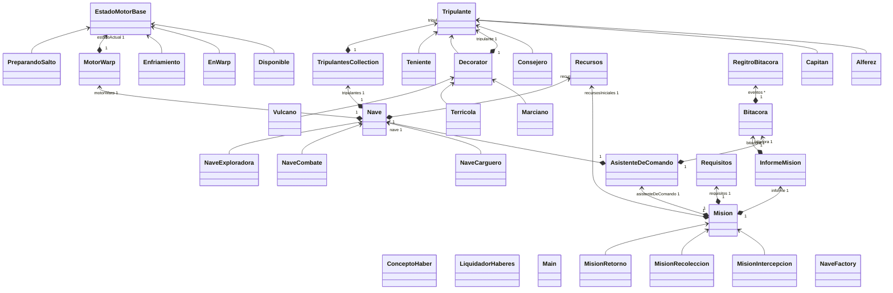

# Diagrama de clases UML:

```mermaid
classDiagram
direction BT
class Alferez
class AsistenteDeComando
class Bitacora
class Capitan
class ConceptoHaber
class Consejero
class Decorator
class Disponible
class EnWarp
class Enfriamiento
class EstadoMotorBase
class InformeMision
class LiquidadorHaberes
class Main
class Marciano
class Mision
class MisionIntercepcion
class MisionRecoleccion
class MisionRetorno
class MotorWarp
class Nave
class NaveCarguero
class NaveCombate
class NaveExploradora
class NaveFactory
class PreparandoSalto
class Recursos
class RegitroBitacora
class Requisitos
class Teniente
class Terricola
class Tripulante
class TripulantesCollection
class Vulcano

Alferez  -->  Tripulante 
AsistenteDeComando "1" *--> "bitacora 1" Bitacora 
AsistenteDeComando "1" *--> "nave 1" Nave 
Bitacora "1" *--> "eventos *" RegitroBitacora 
Capitan  -->  Tripulante 
Consejero  -->  Tripulante 
Decorator "1" *--> "tripulante 1" Tripulante 
Decorator  -->  Tripulante 
Disponible  -->  EstadoMotorBase 
EnWarp  -->  EstadoMotorBase 
Enfriamiento  -->  EstadoMotorBase 
InformeMision "1" *--> "bitacora 1" Bitacora 
Marciano  -->  Decorator 
Mision "1" *--> "asistenteDeComando 1" AsistenteDeComando 
Mision "1" *--> "informe 1" InformeMision 
Mision "1" *--> "recursosIniciales 1" Recursos 
Mision "1" *--> "requisitos 1" Requisitos 
MisionIntercepcion  -->  Mision 
MisionRecoleccion  -->  Mision 
MisionRetorno  -->  Mision 
MotorWarp "1" *--> "estadoActual 1" EstadoMotorBase 
Nave "1" *--> "motorWarp 1" MotorWarp 
Nave "1" *--> "recursos 1" Recursos 
Nave "1" *--> "tripulantes 1" TripulantesCollection 
NaveCarguero  -->  Nave 
NaveCombate  -->  Nave 
NaveExploradora  -->  Nave 
PreparandoSalto  -->  EstadoMotorBase 
Teniente  -->  Tripulante 
Terricola  -->  Decorator 
TripulantesCollection "1" *--> "tripulantes *" Tripulante 
Vulcano  -->  Decorator 
```
