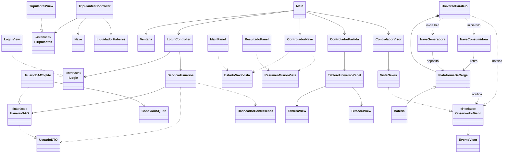

```mermaid
classDiagram
    direction TB

    class UsuarioDAO {
        <<interface>>
    }
    class UsuarioDAOSqlite
    class ConexionSQLite
    class UsuarioDTO
    class ServicioUsuarios
    class HasheadorContrasenas

    class ILogin {
        <<interface>>
    }
    class LoginView
    class LoginController
    class ITripulantes {
        <<interface>>
    }
    class TripulantesView
    class TripulantesController
    class LiquidadorHaberes
    class Nave
    class Main
    class Ventana
    class MainPanel
    class TableroUniversoPanel
    class TableroView
    class BitacoraView
    class ResultadoPanel
    class VistaNaves
    class ControladorNave
    class ControladorPartida
    class ControladorVisor
    class EstadoNaveVista
    class ResumenMisionVista

    class ObservadorVisor {
        <<interface>>
    }
    class EventoVisor
    class UniversoParalelo
    class PlataformaDeCarga
    class NaveGeneradora
    class NaveConsumidora
    class Bateria

    UsuarioDAOSqlite ..|> UsuarioDAO
    UsuarioDAOSqlite --> ConexionSQLite
    UsuarioDAO ..> UsuarioDTO
    ServicioUsuarios --> UsuarioDAO
    ServicioUsuarios ..> UsuarioDTO
    ServicioUsuarios ..> HasheadorContrasenas

    LoginView ..|> ILogin
    LoginController --> ILogin
    LoginController --> ServicioUsuarios
    TripulantesView ..|> ITripulantes
    TripulantesController --> ITripulantes
    TripulantesController ..> Nave
    TripulantesController ..> LiquidadorHaberes

    Main --> Ventana
    Main --> LoginController
    Main --> ControladorNave
    Main --> ControladorPartida
    Main --> ControladorVisor
    ControladorNave ..> EstadoNaveVista
    ControladorNave ..> ResumenMisionVista
    ControladorPartida --> TableroUniversoPanel
    ControladorVisor --> VistaNaves
    TableroUniversoPanel --> TableroView
    TableroUniversoPanel --> BitacoraView
    ResultadoPanel ..> ResumenMisionVista
    MainPanel ..> EstadoNaveVista

    UniversoParalelo *-- PlataformaDeCarga
    UniversoParalelo ..> NaveGeneradora : inicia hilo
    UniversoParalelo ..> NaveConsumidora : inicia hilo
    NaveGeneradora --> PlataformaDeCarga : deposita
    NaveConsumidora --> PlataformaDeCarga : retira
    PlataformaDeCarga o-- Bateria
    UniversoParalelo ..> ObservadorVisor : notifica
    PlataformaDeCarga ..> ObservadorVisor : notifica
    ObservadorVisor ..> EventoVisor
    VistaNaves ..|> ObservadorVisor
```