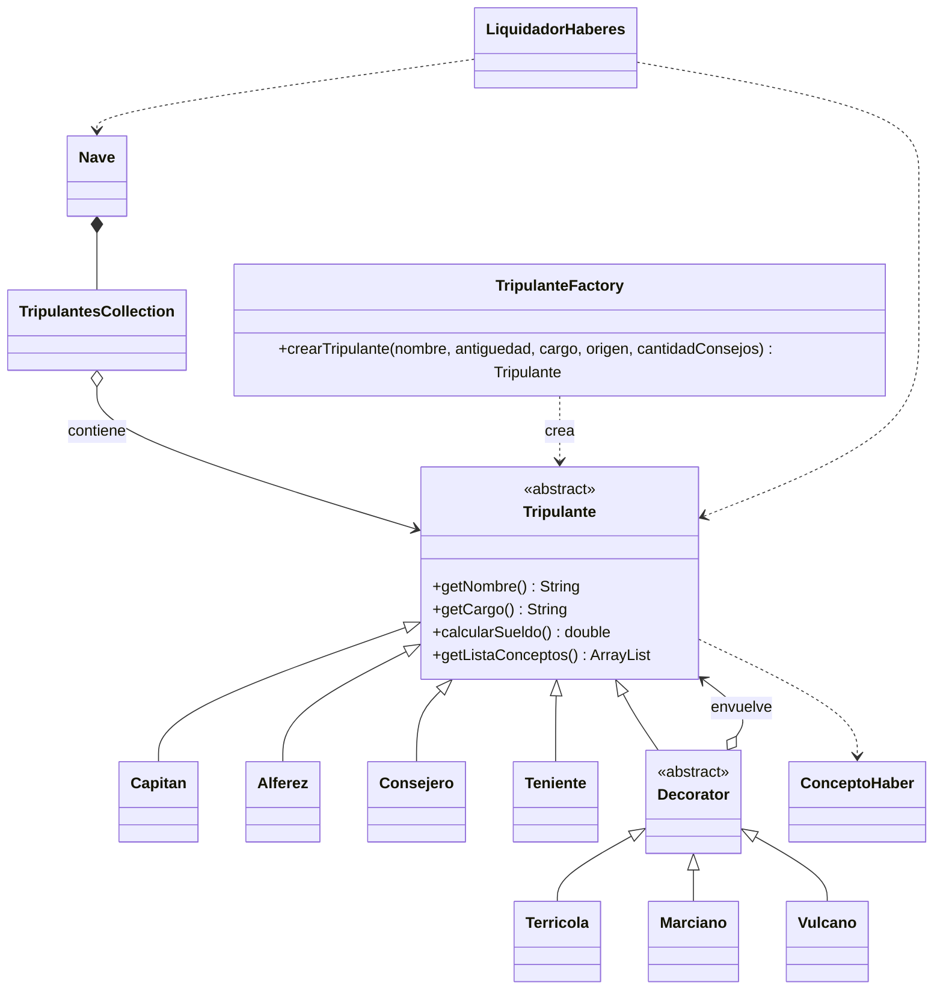

```mermaid
classDiagram
    direction TB

    class Tripulante {
        <<abstract>>
        +getNombre() String
        +getCargo() String
        +calcularSueldo() double
        +getListaConceptos() ArrayList
    }
    class Capitan
    class Alferez
    class Consejero
    class Teniente
    class Decorator {
        <<abstract>>
    }
    class Terricola
    class Marciano
    class Vulcano
    class TripulantesCollection
    class TripulanteFactory {
        +crearTripulante(nombre, antiguedad, cargo, origen, cantidadConsejos) Tripulante
    }
    class ConceptoHaber
    class LiquidadorHaberes
    class Nave

    Tripulante <|-- Capitan
    Tripulante <|-- Alferez
    Tripulante <|-- Consejero
    Tripulante <|-- Teniente
    Tripulante <|-- Decorator
    Decorator <|-- Terricola
    Decorator <|-- Marciano
    Decorator <|-- Vulcano
Decorator o--> Tripulante : envuelve
Tripulante ..> ConceptoHaber
TripulantesCollection o--> Tripulante : contiene
TripulanteFactory ..> Tripulante : crea
Nave *-- TripulantesCollection
LiquidadorHaberes ..> Tripulante
LiquidadorHaberes ..> Nave
```